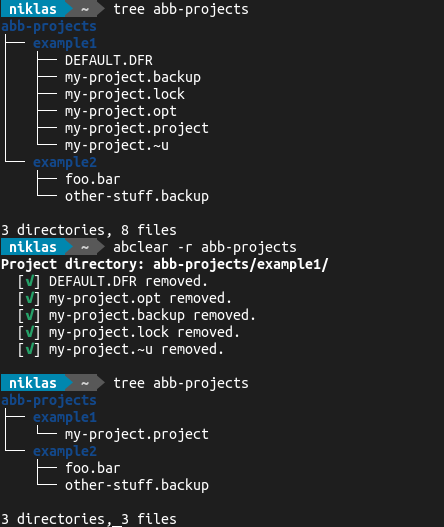

# a-b-clear

Working with *ABB Automation Builder*? This tool leaves a lot of temporary files
behind and over time keeps cluttering your hard drive with them. Once you're
done working on a feature or a project, this simple shell script helps you to
find those temporary files and delete them accordingly.

> :bulb: If the `trash` command is available, the files will be moved to your
recycle bin. Otherwise, they will by irreversible destroyed by `rm`.

**Important notes:**

* I'm not associated with *ABB* or the *Automation Builder* in any form. I have
  been working with this tool for years and personally find this script to be
  useful.
* Any project files are identified solely by a regex on their name! While I've
  been using this script a lot for some time and never encountered any problems
  with this mechanism, think twice before typing! You may lose some important
  data!
* :rotating_light: **This tool deletes files.** As there's currently no dry-mode
  implemented, **USE AT YOUR OWN RISK**. :rotating_light:

## Installation

Just add this shell script as it is to your setup as you like.

Example:

```sh
git clone https://github.com/nbe95/a-b-clear.git ~/.a-b-clear
sudo ln -s ~/.a-b-clear/clear.sh /usr/local/bin/abclear
```

## Usage

Run `a-b-clear` with the directory of your choice. If not provided, the current
working directory will be used. Use the `-r` flag to perform a recursive lookup
and clear all underlying project directories.

Example:


